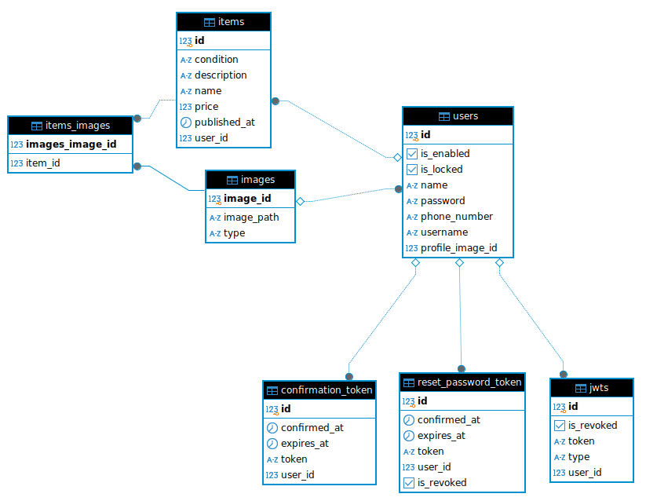

# Marketplace
Marketplace is a web application that allows to users to buy and sell goods. The web application functions as a reliable platform that links sellers on a save platform, enabling them to enjoy their shopping experience.

## Database


## Technologies
- Spring boot
- Spring Security
- Jwt based authentication
- End-to-end encryption
- Spring Jpa
- Postgresql

## Getting started
- Clone the repository ```git clone https://github.com/abb-ah-houdaifa/Marketplace.git```
- Configure the `application.yml` file. Visit ``https://support.google.com/accounts/answer/185833?hl=en`` to configure the mail server
- Build the project `mvn clean install`
- Run the project `mvn spring-boot:run`

Application will start in `http://localhost:8080` by default
